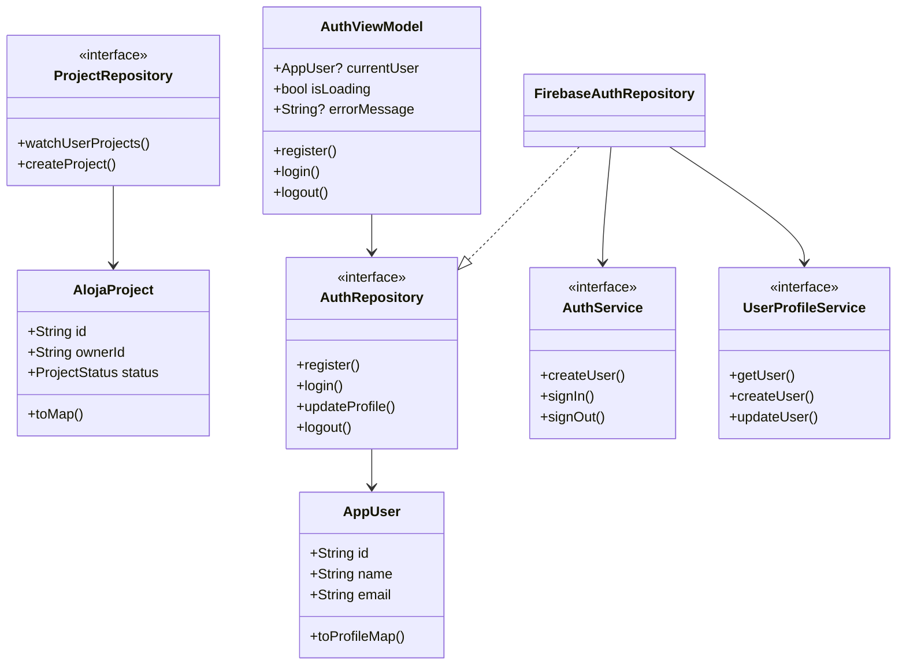
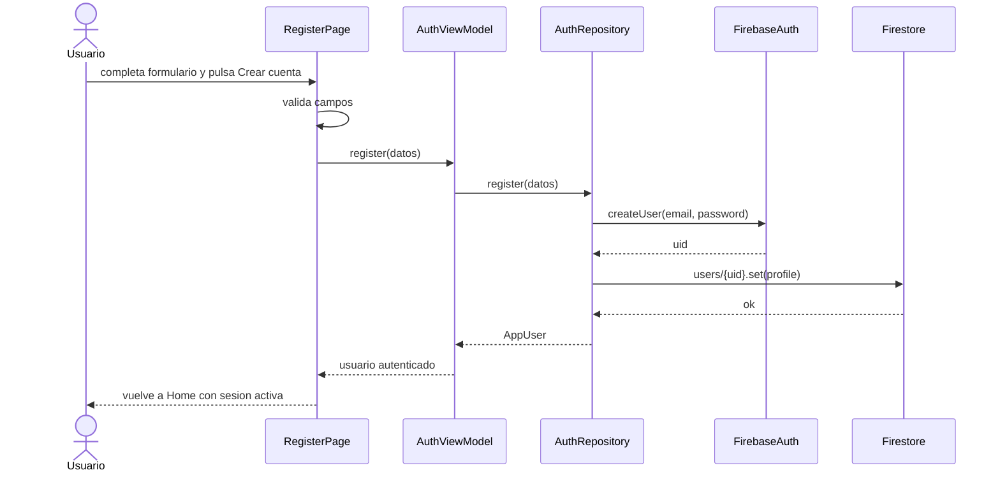

# Hito 2 - Arquitectura Aloja

## Patron Arquitectonico

La aplicacion usa una arquitectura por capas con MVVM en la capa de UI:

- UI: widgets Flutter y `AuthViewModel`.
- Data: repositorios (`AuthRepository`, `ProjectRepository`) y servicios Firebase.
- Domain: modelos limpios (`AppUser`, `AlojaProject`).

## Patrones De Diseno

- Repository: aisla Firebase Auth y Firestore detras de contratos probables.
- MVVM: mueve el estado de autenticacion desde los widgets hacia `AuthViewModel`.
- Dependency Injection: las pantallas reciben repositorios opcionales para usar Firebase en produccion y fakes en pruebas.

## Diagrama De Clases

## Diagrama De Secuencia: Registro

## Modulos Implementados

- `lib/domain/models`: modelos de usuario y proyecto.
- `lib/data/services`: adaptadores Firebase Auth/Firestore.
- `lib/data/repositories`: contratos de autenticacion y proyectos.
- `lib/ui/features/auth/view_models`: estado y comandos del flujo de autenticacion.
- `lib/registrase.dart`, `lib/perfil.dart`, `lib/main.dart`: integracion de UI existente con el modulo nuevo.
